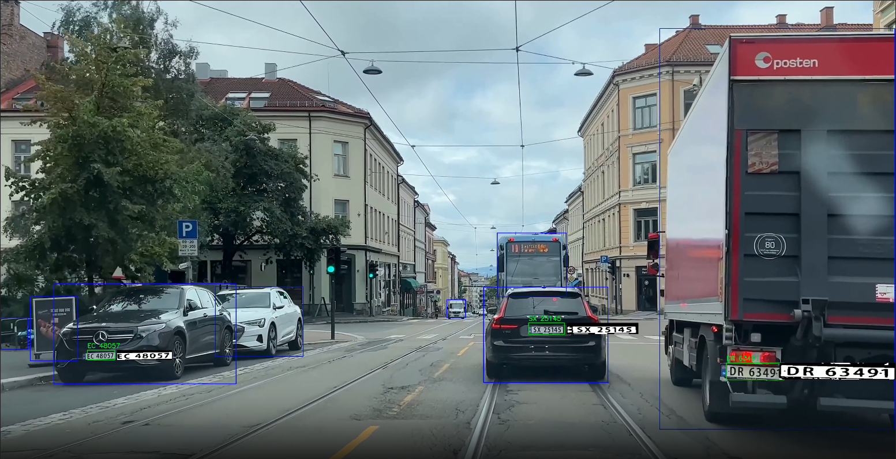

# ObjectDetection

This project provides a complete pipeline for vehicle and license plate detection and tracking. It uses a YOLO model trained specifically for license plate detection and another YOLO model for car detection. The SORT algorithm is integrated to track detected cars across video frames. Detected license plates are associated with their corresponding vehicles, and Optical Character Recognition (OCR) is applied to read the license plate numbers from the detected regions.

## Example

Here is an example :



## Instructions

### 1. Environment Setup

- Install the required dependencies using the `requirements.txt` file in the `ObjectDetection` directory:

    ```bash
    pip install -r requirements.txt
    ```

### 2. Data Preparation

- Clone the OIDv4_ToolKit repository inside a `software` folder within `ObjectDetection`:

    ```bash
    mkdir software
    cd software
    git clone https://github.com/EscVM/OIDv4_ToolKit.git
    ```

- Use OIDv4_ToolKit to extract your dataset (e.g., labeled license plate images). The extracted data will be in the `Dataset/` directory, containing `train`, `test`, and `validation` folders.
- If using license plate data, you will find a folder named "Vehicle registration plate". Group all images into a new `images` folder inside the "Vehicle registration plate" folder, rename the `Labels` folder to `Labels_Not_Yolo`, and create an empty `labels` folder.

### 3. Label Conversion

- Use the scripts in `yolo/convert_labels_to_yolo_format` to convert your labels to YOLO format.
- You can verify the label conversion using the `verify_picture_label` script.

### 4. Model Training and Testing

- To train the model, use the `train_license_plate_model` script.
- To test the model, use the `test_license_plate_model` script.

> **Note:** Make sure you have the appropriate dataset prepared before training or testing.

### 5. Tracking Setup

- Before using `main.py` and `util.py`, clone the SORT repository inside the `yolo` directory:

    ```bash
    cd yolo
    git clone https://github.com/abewley/sort.git
    ```

- Create a `video` folder inside `yolo` and place your video file (e.g., `car.mp4`) there.

### 6. Running the Project

- Follow the scripts and instructions in the respective folders to process your data, train, test, and run tracking on your videos.

For any issues or questions, please refer to the documentation of each toolkit or open an issue in this repository.

## 7. Suggested Folder Structure

Below is the recommended directory layout for this project:

```
ObjectDetection/
├── Python_Env/                # (Optional) Python virtual environment
├── software/
│   └── OIDv4_ToolKit/
│       └── OID/
│           ├── csv_folder/
│           └── Dataset/
│               ├── train/
│               │   └── Vehicle registration plate/
│               │       ├── images/
│               │       ├── labels/
│               │       └── Labels_Not_Yolo/
│               ├── validation/
│               └── test/
├── yolo/
│   ├── saved_model/
│   ├── sort/
│   ├── videos/
│   ├── result.mp4
│   ├── result.csv
│   ├── yolov8n.pt
│   └── *.py                  # Python scripts (e.g., main.py, util.py)
```
